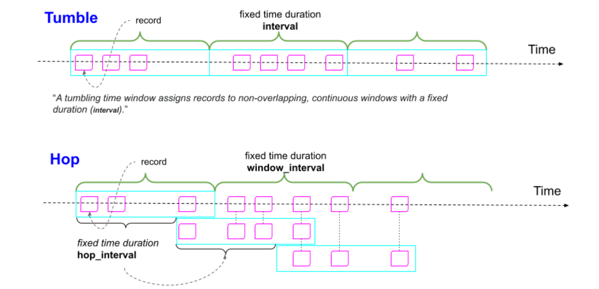
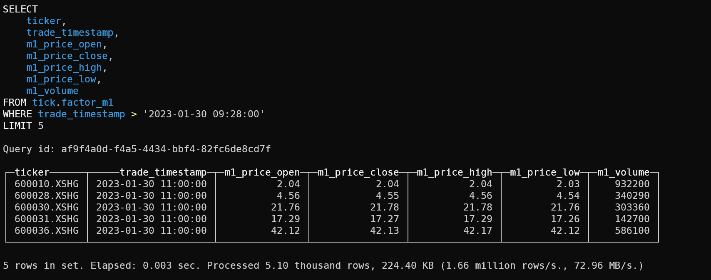
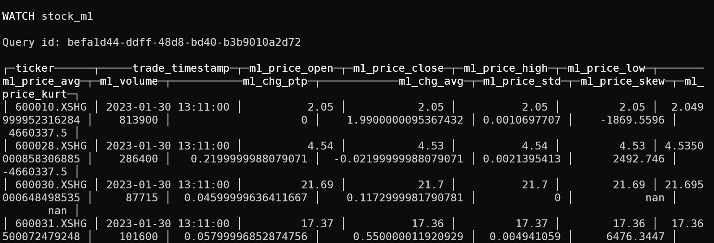

> 金融市场中我们经常会遇到切片数据，例如A股的L1行情，我们处理这类数据的思路无外乎对每一个Ticker，按照时间先后的顺序，在1Min、5Min甚至日线的维度上汇总特征，加工因子。考虑到执行效率问题，手工维护这个流程略显冗繁，本文介绍如何使用Clickhouse数据仓库来自动化的高效完成这类操作，并以K线合成为例完整走一遍流程。


## 一、基本概念

### 1.1 窗口

流数据的计算可以把连续不断的数据按照一定的规则拆分成大量的片段，在片段内进行聚合统计和计算。常见的拆分方法有：

- 以时间为单位的不重叠片段，例如：每1分钟、每1小时等，在流式计算里通常称为Tumble Window。在量化里比如1分钟K线、1小时K线，就是此类型。
- 以时间为单位的重叠片段，例如：前10分钟、前1小时，每隔一个时间间隔向前滚动，前后两个窗口有一定的重合部分，通常称为Hop Window，很明显，Tumble Window是Hop Window的一个特例。在量化里，计算滑动均值，就是这类任务的一个代表。
- 以会话为单位的不连续片段，例如每个HTTP访问会话，可能被其他会话打断，在量化交易中较少涉及，本文不再讨论。



### 1.2 时间

- 处理时间Processing Time，指的是进行数据处理操作时，当时的系统时间。
- 事件时间Event Time，指的是业务发生时间，每一条业务记录上会携带一个时间戳。
- 提取时间Ingestion Time，指的是数据进入处理系统时，当时的系统时间。

很明显，量化系统中，处理历史数据一定会用到事件时间，处理实时数据大部分情况也应用事件时间，少部分情况下可以用处理时间近似代替。本文将默认时间模式为事件时间。

### 1.3 视图

ClickHouse支持创建普通视图(normal view)、物化视图(materialized view)、实时视图(live view)和窗口视图(window view)，其中实时视图和窗口视图目前还是试验功能，不能保证稳定性。

- Normal View：视图本身并不会存储任何的数据，它们仅仅只是读取了所关联的表格的查询结果而已。一个视图其实保存的是一个 select查询的语句，而不是它查询的结果。
- Materialized View：物化视图和普通视图最大的区别是物化视图实际存储了一份数据。用户查询的时候和表没有区别，更像是一张时刻在预计算的表。在创建物化视图的时候也需要定义存储引擎。
- Live View: 实时视图是一种特殊的视图，类似于ZooKeeper中的注册监听和Redis中的发布订阅，能够将一条SQL查询结果作为监控目标，当 Live view 变化时可以及时感知到。
- Window View：窗口可以按时间窗口聚合数据，类似Flink中的Window，并在窗口结束时输出结果。它将部分聚合结果（预聚合）存储在一个内部(或指定的)表中，以减少延迟，并可以将处理结果推送到指定的表或使用WATCH语句查询推送通知。

通过上面的介绍，我们知道通过窗口视图和时间函数，Clickhouse也拥有了流式数据处理能力。但窗口视图处于实验阶段，需要我们手动开启这项功能，开启的方式有两种：
- 在sql语句中添加一条控制开关： `set allow_experimental_window_view = 1`
- 在Clickhouse中增加一个用户配置：
  - 新建文件：nano /etc/clickhouse-server/users.d/allow_experimental_window_functions.xml
  - 写入如下配置：
  ```xml
  <?xml version="1.0"?>
    <yandex>
    <profiles>
        <default>
            <allow_experimental_window_view>1</allow_experimental_window_view>
        </default>
    </profiles>
    </yandex>
  ```

其中增加用户配置方案是永久性的，写入后就默认开启此功能。

## 二、设计数据表

### 2.1 原始tick行情数据加工

通常交易所tick行情提供的字段有：
- open：开盘价
- last：最新价
- high：最高价
- low：最低价
- prev_close：昨收价
- volume：累计成交量
- total_turnover：累计成交额
- change_rate：涨跌幅
- ask_price_1-5：卖出价1-5档
- ask_volume_1-5: 卖出量1-5档
- ask_price_1-5：卖出价1-5档
- ask_volume_1-5: 卖出量1-5档

实时处理时通常要使用一个全局字典，将累计成交量、累计成交额转换成切片瞬时成交量和成交金额, 离线处理我们可用SQL进行简单的转换。

首先创建一张tick数据表(股票代码、交易时间、tick价格、tick成交量、涨跌幅)：
``` SQL
create table tick.sse50_data
(
    ticker String,
    trade_time DateTime('Asia/Shanghai'),
    tick_price_close Float32,
    tick_volume Int32,
    close_chg_rate Float32
)
ENGINE = AggregatingMergeTree()
ORDER BY (trade_time, ticker)
```

然后使用如下SQL进行简单加工，即通过`volume - ifNull(any(volume) OVER (PARTITION BY stock_code ORDER BY trade_time ASC ROWS BETWEEN 1 PRECEDING AND 1 PRECEDING), 0)` 语句获得瞬时成交量：

``` SQL
select 
    stock_code as ticker, 
    trade_time, 
    last as tick_price_close,
    toInt32(volume - ifNull(any(volume) OVER (PARTITION BY stock_code ORDER BY trade_time ASC ROWS BETWEEN 1 PRECEDING AND 1 PRECEDING), 0)) AS tick_volume, 
    round(100 * change_rate, 3)  as close_chg_rate
from tick.sse_50
order by trade_time ASC,  ticker
```

这里我们可以把数据先存储到data对象中，后面用来做行情回放，动态写入`tick.sse50_data`表中

### 2.2 设计1分钟窗口视图

首先创建一张1分钟特征表用来存储加工得到的K线特征(包含1分钟开盘价、收盘价、最高价、最低价、平均价、价格标准差、峰度等统计量):
``` SQL
create table if not exists tick.factor_m1
(
    ticker String,
    trade_timestamp DateTime('Asia/Shanghai'),
    m1_price_open Float32,
    m1_price_close Float32,
    m1_price_high Float32,
    m1_price_low Float32,
    m1_price_avg Float32,
    m1_volume Int32,
    m1_chg_ptp Float32,
    m1_chg_avg Float32,
    m1_price_std Float32,
    m1_price_skew Float32,
    m1_price_kurt Float32
)
ENGINE = AggregatingMergeTree()
ORDER BY (trade_timestamp, ticker)
```

然后创建我们的主角，窗口视图：
``` SQL
CREATE WINDOW VIEW IF NOT EXISTS stock_m1 TO tick.factor_m1  WATERMARK=INTERVAL '2' SECOND  AS
SELECT 
    ticker, 
    tumbleStart(trade_time_id) as trade_timestamp, 
    any(tick_price_close) as m1_price_open, 
    anyLast(tick_price_close) as m1_price_close, 
    max(tick_price_close) as m1_price_high,
    min(tick_price_close) as m1_price_low, 
    0.5 * (m1_price_open + m1_price_close) as m1_price_avg, 
    sum(tick_volume) as m1_volume,
    max(close_chg_rate) - min(close_chg_rate) as m1_chg_ptp,
    avg(close_chg_rate) as m1_chg_avg,
    stddevPop(tick_price_close) as m1_price_std,
    skewPop(tick_price_close) as m1_price_skew,
    kurtPop(tick_price_close) as m1_price_kurt
FROM tick.sse50_data
GROUP BY tumble(trade_time, INTERVAL '1' MINUTE) as trade_time_id, ticker
ORDER BY trade_time_id, ticker
```
其中 `tumble(trade_time, INTERVAL '1' MINUTE)` 表示每1分钟执行一次。

## 三、效果测试

### 3.1 客户端模拟实时插入

``` python
for item in tqdm(data):
    db_client.execute("insert into tick.sse50_data values", [item])
```

### 3.2 查询

在另一个控制台上查询`tick.factor_m1`表，可以发现数据已经实时写入特征表中了(K线与看盘软件有1分钟偏移，因为这里时间戳表示该分钟的起始位置)：



通过WATCH语句，在控制台中我们能看到K线的实时生成：



## 结论

虽然仍处于实验阶段，但Clickhouse的窗口视图显示出强大的流式处理能力，我们可以利用其轻松搭建一个tick级的高频交易系统，自动提取特征入库，省去手工维护之烦恼。

---

欢迎关注我的公众号“**量化实战**”，原创技术文章第一时间推送。


