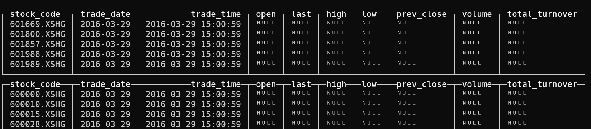
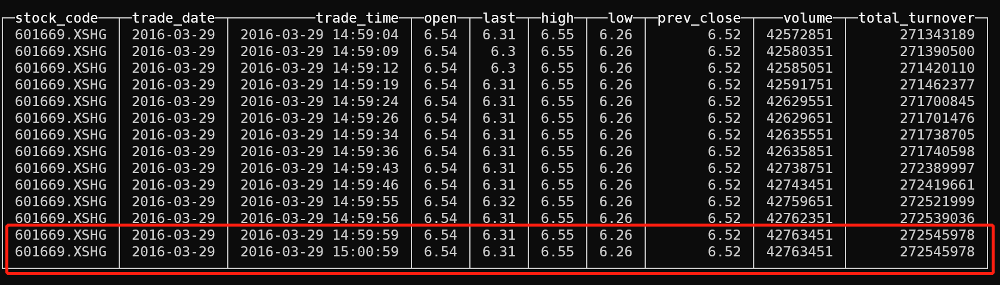

> 数据清洗和理解是数据科学中的基础工作，重要而繁琐，经常占据了80%的工作量，在量化交易中也不例外。本文介绍如何利用Clickhouse数据仓库进行高效的数据清洗工作，以Tick行情处理为例，重点谈谈分析函数的使用。


## 一、分析函数概况

### 1.1 与聚合函数的区别

说到分析函数，就不得不提到聚合函数。聚合函数是汇总计算返回一个计算结果，而分析函数会根据表的行数，每行返回一个计算结果。

- 聚合函数特点：GROUP BY 分组，统计组内的max、min、std等统计值，赋予到聚合组中
- 分析函数特点：PARTITION BY 分组，统计组内的max、min、std等统计值，赋予到当前行中

很明显，分析函数有“序”的概念，通过分组的“序”获取上下文指定范围，进而获取聚合值。

### 1.2 窗口函数的基本用法

语法格式：
``` SQL
<窗口函数> OVER ([PARTITION BY <列清单>]
                         ORDER BY <排序用列清单>)
```

#### 1.2.1 计算排名

计算一分钟K线各个股票的成交额从大到小排名：
``` SQL
select datetime, order_book_id, RANK() OVER (PARTITION BY datetime ORDER BY total_turnover desc) as deal_rank
from rqdata.stock_kline_1m 
where date='2023-01-11' and datetime<='2023-01-11 09:32:00' and order_book_id in ('601318.XSHG', '600536.XSHG', '601012.XSHG')
```
其中`desc`表示逆序排列(从大到小)

#### 1.2.2 获取相邻行

计算一分钟K线每分钟相比上一分钟成交额的占比：
``` SQL
select datetime, order_book_id, total_turnover / anyLast(total_turnover) OVER (PARTITION BY order_book_id ORDER BY datetime asc ROWS BETWEEN UNBOUNDED PRECEDING AND 1 PRECEDING) as deal_rate
from rqdata.stock_kline_1m 
where date='2023-01-11' and datetime<='2023-01-11 09:32:00' and order_book_id in ('601318.XSHG', '600536.XSHG', '601012.XSHG')
```

其中`anyLast`表示取分组中的最后一个不为Null的值，`asc`表示顺序排列(从小到大)，`ROWS BETWEEN UNBOUNDED PRECEDING AND 1 PRECEDING` 表示限制数数据在当前行的前面。

#### 1.2.3 计算窗口报告值

计算一分钟K线未来10分钟的最高收益：
```SQL
select datetime, order_book_id, round(100*(max(high) OVER (PARTITION BY order_book_id ORDER BY datetime asc ROWS BETWEEN 1 FOLLOWING AND 10 FOLLOWING) / close - 1), 3) as min10_high_rate
from rqdata.stock_kline_1m 
where date='2023-01-11' and datetime<='2023-01-11 09:40:00' and order_book_id in ('601318.XSHG', '600536.XSHG', '601012.XSHG')
```

其中`max(high)`取分组中的最大值，`ROWS BETWEEN 1 FOLLOWING AND 10 FOLLOWING` 表示在接下来的10分钟里。

## 二、数据清洗案例

### 2.1 关于Tick行情

Tick行情在国内市场通常称为切片数据，把距离上一个时间点的市场状态以及快照行情提供给用户，沪深股票交易所的切片间隔是3s，期货市场则更短，最快可以达到0.5s。Tick数据不同于逐笔委托和逐笔成交数据，最快为3s，如果一段时间没有成交，这个值就更久远。

由此造成一个问题，`某个1分钟时间段里，可能无法直接由Tick行情得到K线数据`，因此，如果某分钟没有记录，我们需要在其后面补充一条记录，保持K线的完整性。

### 2.2 选出缺失项

首先我们定义`表a`为所有股票代码，`表b`为所有分钟日期，两表做笛卡尔乘积可以得到完整的数据主键，这里通过`cross join`来实现。再通过左反连接`left anti join`排除掉已有的数据主键，这样就选出了需要补充的项：

``` SQL
select 
    a.stock_code as stock_code, 
    toDate('2016-03-29') as trade_date, 
    b.trade_time +  toIntervalSecond(59) as trade_time,  
    null as open, 
    null as last, 
    null as high, 
    null as low, 
    null as prev_close, 
    null as volume, 
    null as total_turnover
from 
    (
        select distinct stock_code from rqdata.sse50_tick where trade_date='2016-03-29'
    ) a 
cross join
    (
        with toHour(trade_time) * 60 + toMinute(trade_time) as trade_minute
        select distinct toStartOfMinute(trade_time) as trade_time from rqdata.sse50_tick where trade_date='2016-03-29' and trade_minute != 11 * 60 + 30 and trade_minute != 9 * 60 + 29 and trade_minute != 12 * 60 + 59 and  trade_minute>= 9*60 + 25
    ) b
left anti join 
    (
        select distinct stock_code, toStartOfMinute(trade_time) as trade_time from rqdata.sse50_tick where trade_date='2016-03-29'
    ) c
    on a.stock_code = c.stock_code and b.trade_time = c.trade_time
```

可以发现，部分股票没有15:00的收盘价


### 2.3 利用分析函数填充缺失项

``` SQL
select 
    stock_code,  trade_date, trade_time, 
    anyLast(open) over (PARTITION BY stock_code  ORDER BY trade_time ROWS BETWEEN UNBOUNDED PRECEDING AND CURRENT ROW) as open,
    ...
from
    ...
```

### 2.4 与原始数据并联后的完整语句

``` SQL
select * from 
(
    select 
        stock_code,  trade_date, trade_time, 
        anyLast(open) over (PARTITION BY stock_code  ORDER BY trade_time ROWS BETWEEN UNBOUNDED PRECEDING AND CURRENT ROW) as open,
        anyLast(last) over (PARTITION BY stock_code  ORDER BY trade_time ROWS BETWEEN UNBOUNDED PRECEDING AND CURRENT ROW) as last,
        anyLast(high) over (PARTITION BY stock_code  ORDER BY trade_time ROWS BETWEEN UNBOUNDED PRECEDING AND CURRENT ROW) as high,
        anyLast(low) over (PARTITION BY stock_code  ORDER BY trade_time ROWS BETWEEN UNBOUNDED PRECEDING AND CURRENT ROW) as low,
        anyLast(prev_close) over (PARTITION BY stock_code  ORDER BY trade_time ROWS BETWEEN UNBOUNDED PRECEDING AND CURRENT ROW) as prev_close,
        anyLast(volume) over (PARTITION BY stock_code  ORDER BY trade_time ROWS BETWEEN UNBOUNDED PRECEDING AND CURRENT ROW) as volume,
        anyLast(total_turnover) over (PARTITION BY stock_code  ORDER BY trade_time ROWS BETWEEN UNBOUNDED PRECEDING AND CURRENT ROW) as total_turnover
    from 
    (
        select 
        a.stock_code as stock_code, 
        toDate('2016-03-29') as trade_date, 
        b.trade_time +  toIntervalSecond(59) as trade_time,  
        null as open, 
        null as last, 
        null as high, 
        null as low, 
        null as prev_close, 
        null as volume, 
        null as total_turnover
    from 
        (
            select distinct stock_code from rqdata.sse50_tick where trade_date='2016-03-29'
        ) a 
    cross join
        (
            with toHour(trade_time) * 60 + toMinute(trade_time) as trade_minute
            select distinct toStartOfMinute(trade_time) as trade_time from rqdata.sse50_tick where trade_date='2016-03-29' and trade_minute != 11 * 60 + 30 and trade_minute != 9 * 60 + 29 and trade_minute != 12 * 60 + 59 and  trade_minute>= 9*60 + 25
        ) b
    left anti join 
        (
            select distinct stock_code, toStartOfMinute(trade_time) as trade_time from rqdata.sse50_tick where trade_date='2016-03-29'
        ) c
        on a.stock_code = c.stock_code and b.trade_time = c.trade_time
    union all
    select 
        stock_code,  trade_date, trade_time, open, last, high, low, prev_close, volume, total_turnover 
    from rqdata.sse50_tick where trade_date='2016-03-29'
    )
) where stock_code='601669.XSHG' and trade_time>'2016-03-29 14:59:00'
```



可以看到，最后一行进行了填充，当时间精确到分钟后，便得到收盘价。

## 结论

分析函数，也叫OLAP函数(Online Anallytical Processing，联机分析处理)，可以对数据库数据进行实时分析处理。比起Python中的数据处理包Pandas，可以利用数据库软件自身的多线程机制进行加速，高效地完成数据分析工作。

---

欢迎关注我的公众号“**量化实战**”，原创技术文章第一时间推送。

